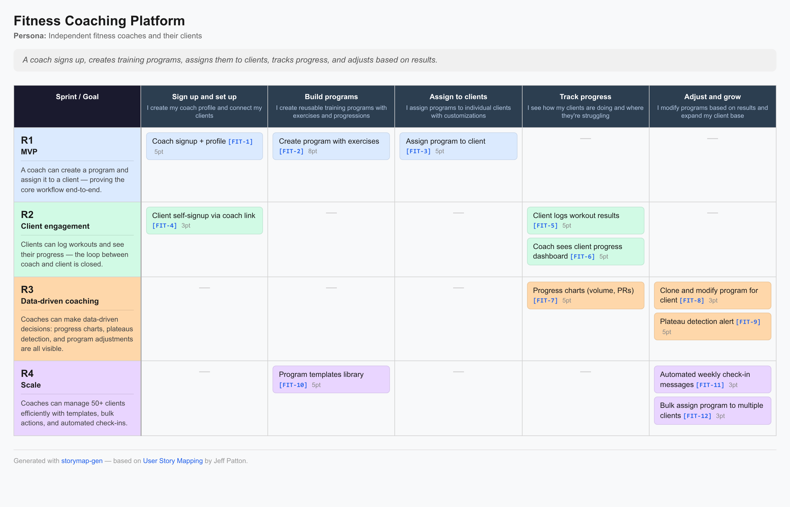

# storymap-gen

Generate **user story maps** (Jeff Patton style) from a single JSON file.
Output as ASCII art, HTML, or Markdown — perfect for planning docs, wikis, and CI pipelines.



## Why?

Most task management tools (Jira, Linear, GitHub Issues) work great for tracking
individual tickets inside a sprint, but they **don't connect sprints to the
bigger picture**: the functional slices of your product that span across
sprints. That connection — *"what can a user actually do after this release,
end to end?"* — is what [user story mapping](https://jpattonassociates.com/user-story-mapping/)
by [Jeff Patton](https://jpattonassociates.com/) is all about.

`storymap-gen` fills that gap. You describe your backbone (activities) and
your release slices in one JSON file, and it renders a visual story map that
shows how stories flow across activities and releases — the view no ticketing
tool gives you out of the box.

## Install

```bash
pip install git+https://github.com/yonie/storymap-gen
```

Or from a local clone:

```bash
pip install -e .
```

## Quick start

```bash
# Validate your JSON (no output produced)
storymapgen storymap.json --check

# ASCII art (default, prints to stdout)
storymapgen storymap.json

# HTML (self-contained page, prints to stdout)
storymapgen storymap.json -f html -o storymap.html

# Markdown (renders in Notion, GitHub, etc.)
storymapgen storymap.json -f markdown -o storymap.md

# All formats at once
storymapgen storymap.json -f all -o docs/
```

You can also run it as a module:

```bash
python -m storymapgen storymap.json
```

## Live preview with `--serve`

While editing your story map, run a local web server and refresh the browser
after each change:

```bash
storymapgen storymap.json --serve
# Serving story map at http://localhost:8765/storymap.html
```

This is especially powerful when iterating on the JSON with an AI model
(see [AI workflow](#ai-workflow) below).

## JSON schema

The schema uses **stable string IDs** to link stories to activities and
releases. Reorder, insert, or rename activities and releases at any time —
your stories stay linked to the right ones.

```json
{
  "title": "My Product",
  "persona": "End users",
  "narrative": "A one-line story of what the user does",
  "ticket_url_template": "https://linear.app/myteam/issue/{ticket}",
  "activities": [
    {"id": "discover", "title": "Discover", "description": "I find the product and understand what it does"},
    {"id": "signup", "title": "Sign up", "description": "I create an account and get started"}
  ],
  "releases": [
    {"id": "R1", "label": "MVP", "goal": "A user can sign up and use the core feature end-to-end.", "color": "#dbeafe"},
    {"id": "R2", "label": "Engagement", "goal": "Users come back and use the feature again.", "color": "#d1fae5"}
  ],
  "stories": [
    {"id": "S1", "activity": "discover", "release": "R1", "title": "Landing page", "ticket": "PROJ-1", "estimate": 3},
    {"id": "S2", "activity": "signup", "release": "R1", "title": "Email signup", "ticket": "PROJ-2", "estimate": 5},
    {"id": "S3", "activity": "signup", "release": "R2", "title": "Social login", "ticket": "PROJ-5", "estimate": 5},
    {"id": "S4", "activity": "discover", "release": "R2", "title": "SEO optimization", "new": true}
  ]
}
```

### Fields

| Field | Where | Required | Description |
|---|---|---|---|
| `title` | root | yes | Product/project name |
| `persona` | root | no | Who the map is for |
| `narrative` | root | no | One-line user story summary |
| `ticket_url_template` | root | no | URL template with `{ticket}` placeholder for clickable ticket links |
| `id` | activity | yes | Stable identifier (referenced by stories) |
| `title` | activity | yes | Display name (backbone step) |
| `description` | activity | no | Short explanation shown under the title |
| `id` | release | yes | Stable identifier (referenced by stories) |
| `label` | release | yes | Display name (e.g. "MVP") |
| `goal` | release | no | What the user can do after this release |
| `color` | release | no | Hex color for the release row (e.g. `#dbeafe`) |
| `id` | story | yes | Unique story identifier |
| `activity` | story | yes | ID of the activity this story belongs to |
| `release` | story | no | ID of the release this story is planned in (omit for backlog) |
| `title` | story | yes | Story title |
| `ticket` | story | no | Ticket ID (e.g. `PROJ-1`) — rendered as a link if `ticket_url_template` is set |
| `estimate` | story | no | Story point estimate (shown as `Npt`) |
| `new` | story | no | If `true`, shows a `NEW` badge and no ticket link |

### Validation

Run `--check` to validate your JSON without producing output. It catches:
- Missing required fields
- Duplicate activity/release/story IDs
- Stories referencing non-existent activities or releases
- Wrong types and malformed structure

```bash
storymapgen storymap.json --check
# OK: storymap.json
#   title: My Product
#   activities: 2
#   releases: 2
#   stories: 4
```

On error, you get a clear message and a non-zero exit code — suitable for CI.

## Ticket system linking

Set `ticket_url_template` at the root with a `{ticket}` placeholder. Ticket IDs
in stories become clickable links in HTML and Markdown output. Works with any
ticketing tool:

**Linear:**
```json
"ticket_url_template": "https://linear.app/myteam/issue/{ticket}"
```

**Jira:**
```json
"ticket_url_template": "https://myteam.atlassian.net/browse/{ticket}"
```

**GitHub Issues:**
```json
"ticket_url_template": "https://github.com/myorg/myrepo/issues/{ticket}"
```

See the `examples/` directory for each of these in use.

## Keep the JSON in your repo

We recommend keeping `storymap.json` in your project repository (e.g.
`docs/storymap.json`) and **committing it**. Every sprint re-slice, story
addition, or release re-plan becomes a reviewable git diff — your team can
comment on it in PRs, and the story map evolves alongside the codebase.

### AI workflow

This is where `storymap-gen` shines. The JSON format is simple enough for any
LLM to read and reshape. The recommended loop:

1. Open `docs/storymap.json` in your editor
2. Ask an AI model to reshape it: *"Add a new activity for onboarding and
   redistribute R1 stories accordingly"* or *"Split R3 into two releases based
   on the goals"*
3. Run `storymapgen docs/storymap.json --serve`
4. Refresh the browser to see the result
5. `git diff docs/storymap.json` to review what the AI changed
6. Commit or iterate

Because references are ID-based (not index-based), AI edits are far less
likely to silently corrupt the map by inserting an activity and forgetting
to renumber story indices.

### CI / build pipeline

Generate story map artifacts as a build step:

```bash
# In your CI script:
storymapgen docs/storymap.json --check
storymapgen docs/storymap.json -f all -o docs/build/
```

Commit the HTML/Markdown output, or publish it as a release artifact. The
`--check` step ensures invalid JSON fails the build.

## Examples

The `examples/` directory contains three complete story maps:

| File | Domain | Ticket system |
|---|---|---|
| `fitness-coaching.json` | Fitness coaching platform | Linear |
| `music-school.json` | Music school management | Jira |
| `volunteer-coordination.json` | Volunteer coordination | GitHub Issues |

Try them:

```bash
storymapgen examples/fitness-coaching.json --serve
storymapgen examples/music-school.json -f html -o /tmp/music.html
storymapgen examples/volunteer-coordination.json -f markdown
```

## Acknowledgments

This tool implements the **user story mapping** method developed by
[Jeff Patton](https://jpattonassociates.com/), author of
[*User Story Mapping*](https://www.oreilly.com/library/view/user-story-mapping/9781491904893/)
(O'Reilly, 2014). Read his original explanation at
[jpattonassociates.com/user-story-mapping](https://jpattonassociates.com/user-story-mapping/).

## License

MIT